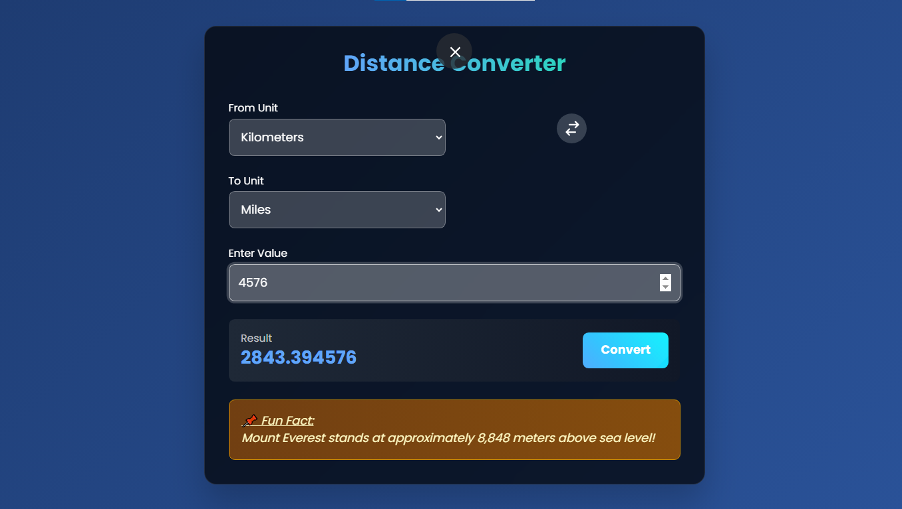

# 🌐 Interactive Distance Converter

A visually aesthetic and interactive web application that allows users to convert distances between multiple units in real-time — built using **HTML, Tailwind CSS, and JavaScript**. 🚀



---

## 📌 Features

- 🔄 Convert between **8+ units**: Kilometers, Miles, Meters, Centimeters, Millimeters, Inches, Feet, Yards
- ⚡ Real-time conversion as user types
- 🌀 Swap units with a smooth button interaction
- 🧠 Displays **random fun facts** with each conversion
- 🎨 Stylish modern UI using TailwindCSS with animated elements
- 🎯 Responsive design for mobile and desktop screens

---

## 🛠️ Technologies Used

- **HTML5**
- **Tailwind CSS** (via CDN)
- **Vanilla JavaScript**
- **Google Fonts** (Poppins)

---

## 💻 How to Run Locally

1. Clone this repository:
   ```bash
   git clone https://github.com/sulekhathakur/DIstanceConverter.git
